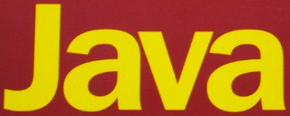

## Skeletonize DNN
VGGNet based DNN for recognition skeletonized character

### Reference
[Skeletonize](https://scikit-image.org/docs/dev/auto_examples/edges/plot_skeleton.html) | [Deep-text](https://github.com/clovaai/deep-text-recognition-benchmark) | [CRAFT](https://github.com/clovaai/CRAFT-pytorch)

### OverView

This model is for performance assistance in cases where the recognition rate is low in the existing OCR performance, and consists of Skeletonize and VGG.

 

### Update
**17.08.2020** : Initial update

**Now attending...**

### Key word
- Pytorch 
- VGGNet
- Skeletonize

### Dataset
**Total dataset is based by their dataset, extract if that image's deep-text-recognition conf score are over 60%**
- IC13
- IC15
- IC17
- CTW1500
- Synth text data set
- TotalText

  
